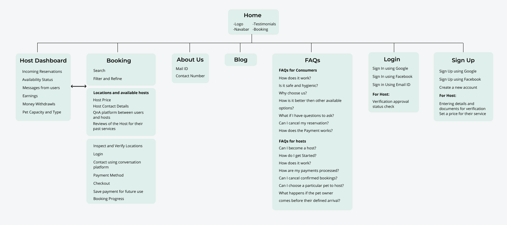
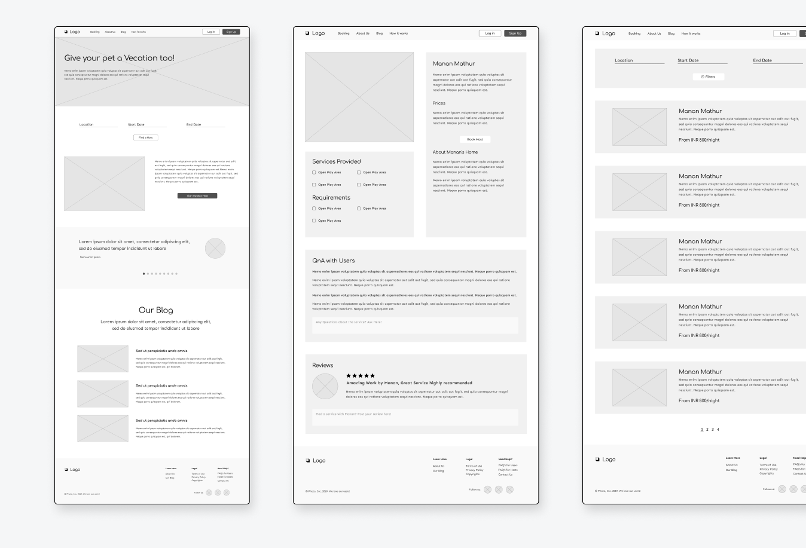
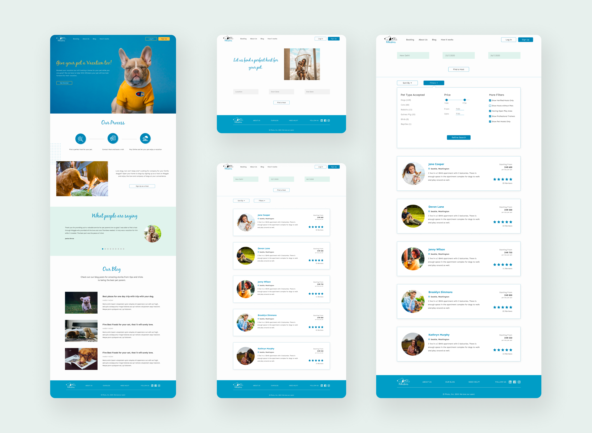
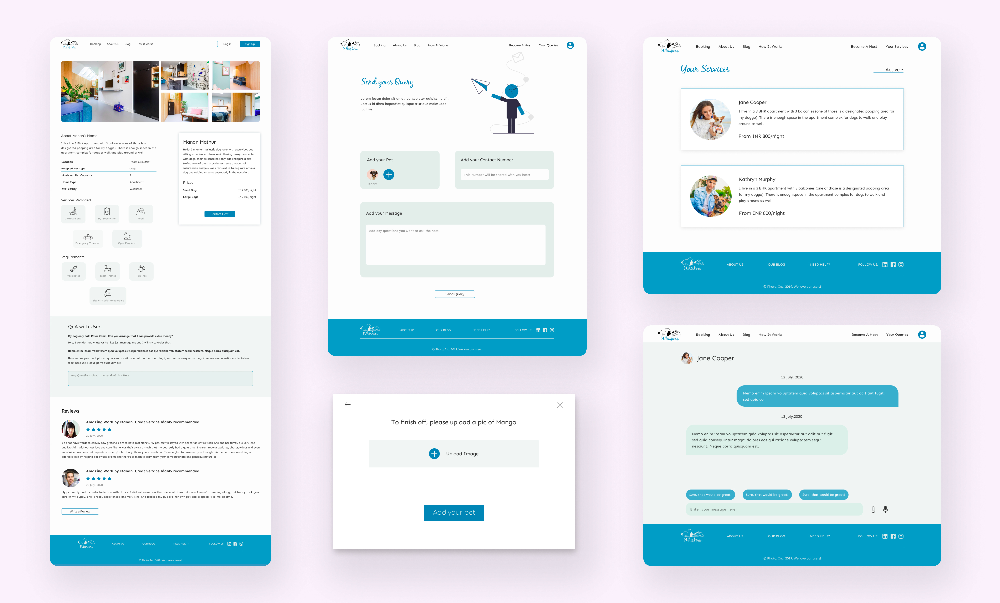
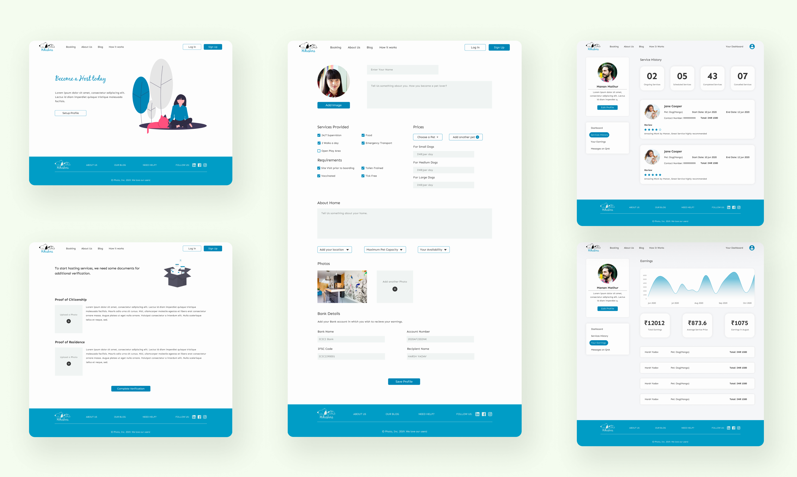
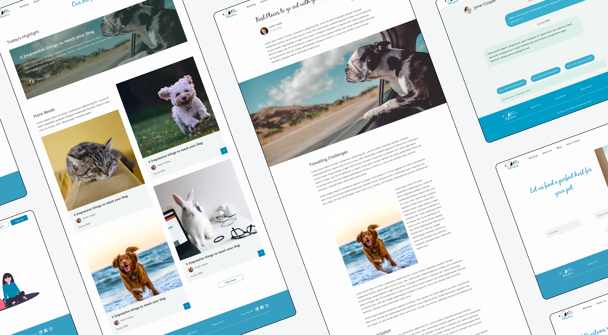

# Whiskers

Whiskers allow users to directly connect with people who are pet lovers and are ready to host the pets at their places.

There is currently no good platform in the market that offers Reliable Pet Boarding Services. This has been a huge problem among pet owners who wants a safe, friendly, and reliable environment for their loved ones when they are gone.

## Information Architecure
    

## Wireframes

    

## Features Offered
There were a lot of designs created for this platform. To adequately explain the designs and their functionalities, I segmented them according to the task they are performing.

* ### Find a Host

    These screens include the Homepage of Whiskers, which introduces users to the platform — Explaining Process, How to Become a host, and Blog. The following screens allow pet owners to find a perfect host using several filtering features such as Date, Location, Pet Type, Price, and much more…

    

* ### Contact a Host

    The Host screen allows the user to find all the information regarding the pet hosts. The users can send a query to the hosts with all the info regarding their pets. I implemented this using a series of overlay modals, which can be seen in the image below. If the host accepts the user’s query, it will be shown under the “Your Services” Section on the platform, which allows the user to chat with the host and book a visit if required.

    

* ### Become a Host

    Whiskers allow individuals to become a host by completing their profile and submitting several documents for verification. This allows only those people to become hosts who genuinely care about pets. The platform also provides Dashboard for hosts with all essential features such as Service History, Earning Analytics, and so on…

        

* ### Whiskers Blog

    Whiskers Blog allows users to learn more about pet care in general and to grow the Whiskers Community.

            